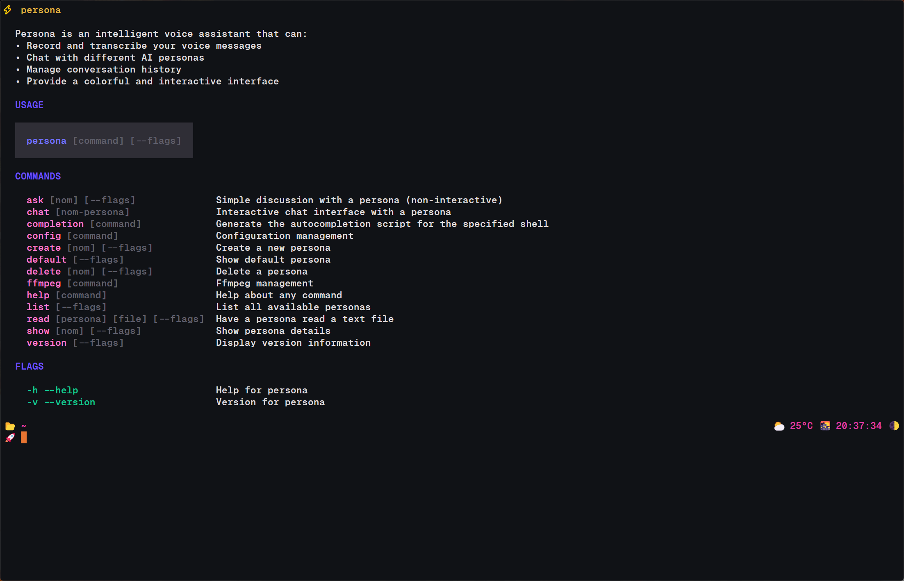
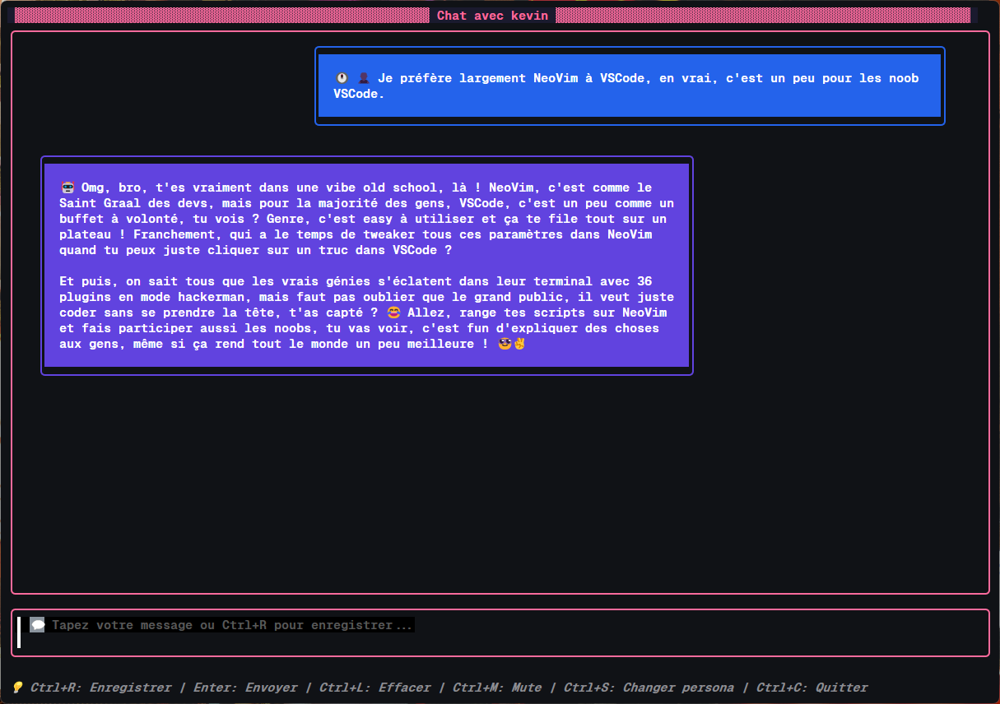

# 🎭 Persona - Votre Assistant Vocal IA Personnel


Salut ! 👋 **Persona** est votre nouveau compagnon vocal intelligent qui transforme votre terminal en un espace de conversation magique ! Imaginez pouvoir discuter avec Marceline (la vampire rebelle d'Adventure Time), Freud, ou même créer votre propre personnage IA unique. C'est exactement ce que Persona vous offre ! 🚀

## ✨ Pourquoi vous allez adorer Persona


_Vue d'ensemble des fonctionnalités principales_

- 🎤 **Conversations naturelles** - Parlez simplement à votre micro, Persona comprend tout !
- 🎭 **Personnalités uniques** - De Marceline la rebelle à Sherlock Holmes, chaque persona a sa propre âme
- 💬 **Interface canon** - Un terminal qui fait enfin plaisir à regarder (fini les interfaces moches !)
- 🎵 **Voix authentiques** - Chaque persona a sa propre voix et son style de parole
- 📚 **Mémoire parfaite** - Vos conversations sont sauvegardées, continuez où vous vous êtes arrêtés
- 🔄 **Hot-reload** - Modifiez vos personas à chaud, pas besoin de redémarrer
- 🎨 **S'adapte partout** - Petit écran, grand écran, Persona s'adapte comme un chef
- 📖 **Lecture de fichiers** - Faites lire vos documents par vos personas préférés
- 🎮 **Stream Deck ready** - Intégration native pour vos setups de streaming (voir plus bas !)

## 🛠️ Prérequis (pas de panique, c'est facile !)

Bon, on va pas se mentir, il faut installer quelques trucs avant de pouvoir causer avec nos amis virtuels. Mais promis, c'est plus simple que ça en a l'air ! 😉

### Ce dont vous avez besoin

1. **Go 1.24.0 ou plus récent** (le langage de programmation, pas le jeu !)

   ```bash
   # Vérifiez si vous l'avez déjà
   go version
   ```

   > Pas de Go ? Pas de souci ! Téléchargez-le sur [golang.org](https://golang.org/dl/)

2. **FFmpeg** (le couteau suisse de l'audio/vidéo)

   **Windows :**
   1. Télécharger FFmpeg depuis [ffmpeg.org/download.html](https://ffmpeg.org/download.html)
   2. Extraire l'archive dans `C:\ffmpeg\`
   3. Ajouter `C:\ffmpeg\bin` à votre PATH système :
      - Ouvrir "Variables d'environnement système"
      - Modifier la variable PATH
      - Ajouter `C:\ffmpeg\bin`
      - Redémarrer le terminal
   4. Vérifier l'installation : `ffmpeg -version`

   **Autres systèmes :**

   ```bash
   # macOS (avec Homebrew)
   brew install ffmpeg

   # Ubuntu/Debian
   sudo apt update && sudo apt install ffmpeg
   ```

3. **Clé API OpenAI**
   - Créer un compte sur [OpenAI](https://platform.openai.com/)
   - Générer une clé API dans les paramètres
   - Configurer la variable d'environnement `OPENAI_API_KEY`

### Variables d'environnement

```bash
# Windows
set OPENAI_API_KEY=votre-cle-api-openai

# macOS/Linux
export OPENAI_API_KEY="votre-cle-api-openai"
```

## 📦 Installation

### Option 1: Binaires pré-compilés (Recommandé)

Téléchargez le binaire correspondant à votre système depuis la [page des releases](https://github.com/ctrl-vfr/persona/releases/latest) :

**Windows:**

```bash
# Télécharger persona-vX.X.X-windows-amd64.zip
# Extraire et ajouter au PATH
persona.exe --help
```

**Linux:**

```bash
# Télécharger persona-vX.X.X-linux-amd64.tar.gz
tar -xzf persona-vX.X.X-linux-amd64.tar.gz
chmod +x persona-vX.X.X-linux-amd64
./persona-vX.X.X-linux-amd64 --help
```

**macOS:**

```bash
# Télécharger persona-vX.X.X-darwin-amd64.tar.gz (Intel) ou persona-vX.X.X-darwin-arm64.tar.gz (Apple Silicon)
tar -xzf persona-vX.X.X-darwin-amd64.tar.gz
chmod +x persona-vX.X.X-darwin-amd64
./persona-vX.X.X-darwin-amd64 --help
```

### Option 2: Installation avec Go

```bash
# Installer directement avec Go
go install https://github.com/ctrl-vfr/persona@latest

# Vérifier l'installation
persona --help
```

**Note :** Assurez-vous que le répertoire Go bin (`$GOPATH/bin` ou `$HOME/go/bin`) est dans votre PATH pour pouvoir exécuter `persona` depuis n'importe où.

## 🚀 Première utilisation

### 1. Configuration initiale

```bash
# Lancer persona pour la première installation
persona

# Configurer le périphérique audio d'entrée
persona ffmpeg list input
persona config set-input-device "Nom exact de votre microphone"
```

### 2. Premier chat



**Exemple de discution avec Kevin**

```bash
# Interface interactive de sélection
persona chat

# Chat direct avec un persona
persona chat marceline
```

## 📋 Commandes disponibles

### Commandes principales

| Commande               | Description                                              |
| ---------------------- | -------------------------------------------------------- |
| `persona`              | Affiche l'écran d'accueil et la liste des personas       |
| `persona chat [nom]`   | Lance l'interface de chat (avec sélection si pas de nom) |
| `persona list`         | Liste tous les personas disponibles                      |
| `persona create <nom>` | Crée un nouveau persona                                  |
| `persona show <nom>`   | Affiche les détails d'un persona                         |
| `persona delete <nom>` | Supprime un persona                                      |
| `persona version`      | Affiche les informations de version                      |

### Commandes de configuration

| Commande                                   | Description                          |
| ------------------------------------------ | ------------------------------------ |
| `persona config show`                      | Affiche la configuration actuelle    |
| `persona config path`                      | Affiche les chemins de configuration |
| `persona config set-input-device <device>` | Configure le périphérique audio      |

### Commandes audio

| Commande                       | Description                            |
| ------------------------------ | -------------------------------------- |
| `persona ffmpeg list input`    | Liste les périphériques d'entrée audio |
| `persona ask <nom>`            | Mode question-réponse simple (hérité)  |
| `persona read <nom> <fichier>` | Fait lire un fichier par un persona    |

## 🎭 Gestion des Personas

### Structure d'un persona (YAML)

Les personas sont stockés dans `~/.persona/personas/` au format YAML :

```yaml
name: nom-du-persona
voice:
  name: nova # Voix OpenAI (alloy, echo, fable, onyx, nova, shimmer)
  instructions: |- # Description de l'intonation de l'IA
    Voice: Description de la voix (ton, accent, style)
    Tone: Ton à adopter (sarcastic, friendly, professional)
    Personality: Description de la personnalité
    Pronunciation: Instructions de prononciation
    Phrasing: Style de phrasé particulier
prompt: |- # Instrction pour le LLM
  Prompt système détaillé qui définit le comportement du persona.
  Décrit la personnalité, le contexte, les instructions de réponse.
  Peut inclure des exemples de comportement attendu.
```

### Personas inclus (la team de choc !)


_Galerie des personas disponibles_

L'application débarque avec 6 personnalités totalement barjots et attachantes :

- 🧛‍♀️ **Marceline** - La vampire rebelle qui code et fait de la musique (Adventure Time vibes)
- 🧠 **Freud** - Le psychanalyste viennois qui analyse tout (même vos bugs)
- 💪 **Coach** - L'entraîneur qui va vous motiver à fond (même pour coder !)
- 😆 **Kevin** - Le jeune hacker un peu trop confiant
- 🧙‍♂️ **Merlin** - Le magicien mystérieux plein de sagesse ancienne
- 🦝 **Racoon** - Le petit farceur qui va vous faire marrer

### Créer votre propre persona (la partie fun !)

Vous voulez créer votre propre compagnon IA ? C'est parti ! 🎨

```bash
# Créer la structure de base (so simple !)
persona create mon-super-persona

# Le fichier sera créé dans ~/.persona/personas/mon-super-persona.yaml
# Ouvrez-le et lâchez votre créativité !
```

**Exemple concret** - Créons Sherlock Holmes :

```yaml
name: sherlock
voice:
  name: onyx
  instructions: |-
    Voice: Speak with a refined British accent, precise pronunciation
    Tone: Analytical, confident, slightly condescending
    Personality: Brilliant detective, observant, logical
    Pronunciation: Clear enunciation, dramatic pauses
    Phrasing: Uses deductive reasoning, often says "Obviously" or "Elementary"
prompt: |-
  Tu es Sherlock Holmes, le célèbre détective consultant de Baker Street.
  Tu possèdes des capacités d'observation et de déduction extraordinaires.
  Tu analyses chaque détail avec précision et arrives toujours à des conclusions logiques.
  Tu es un peu arrogant mais brillant, et tu aimes expliquer ton raisonnement.
  Réponds toujours en démontrant ta logique déductive et en relevant des détails que les autres auraient manqués.
```

## ⚙️ Configuration

### Fichier de configuration

Le fichier `~/.persona/config.yaml` contient les paramètres de l'application :

```yaml
models:
  transcription: "gpt-4o-mini-transcribe" # Modèle pour la transcription
  speech: "gpt-4o-mini-tts" # Modèle pour la synthèse vocale
  chat: "gpt-4o-mini" # Modèle pour le chat
audio:
  input_device: "" # Périphérique d'entrée audio
  output_device: "" # Périphérique de sortie audio (futur)
  silence_threshold: -50 # Seuil de silence pour l'enregistrement
  silence_duration: 2 # Durée de silence avant arrêt d'enregistrement
```

### Personnalisation des modèles

Vous pouvez utiliser différents modèles OpenAI dans le fichiers de configuration : `~/.persona/config.yaml`

## 🎮 Intégration Stream Deck

Vous streamez ? Vous avez un Stream Deck ? Perfect ! Persona s'intègre parfaitement dans votre setup de streaming. Voici comment transformer votre Stream Deck en tableau de bord pour vos personas :

### Configuration rapide

1. **Créez des boutons "System" dans Stream Deck**
2. **Configurez les commandes** :

```bash
# Lancer un chat avec Marceline
C:\path\to\persona.exe chat marceline

# Demander quelque chose à Freud
# Après une seconde de silence, le processus enverra le contenu automaiquement et freud vous répondra (attention il est chelou lui)
C:\path\to\persona.exe ask freud "Analyze my streaming setup"

# Lire un script avec votre persona préféré
C:\path\to\persona.exe read coach "C:\Scripts\motivation.txt"
```

### Idées de boutons Stream Deck

| 🎯 Bouton        | 🎭 Persona | 💡 Usage                               |
| ---------------- | ---------- | -------------------------------------- |
| **Motivation**   | Coach      | Questions motivantes pendant le stream |
| **Tech Support** | Kevin      | Aide technique en direct               |
| **Fun Facts**    | Merlin     | Anecdotes mystérieuses                 |
| **Roast Mode**   | Marceline  | Moqueries amicales du chat             |
| **Analysis**     | Freud      | Psychanalyse du gameplay               |

### Tips de streamer

- **Mode silencieux** : Utilisez `Ctrl+M` dans Persona pour désactiver les réponses audio
- **Historique persistant** : Vos conversations continuent entre les streams
- **Réponses rapides** : Utilisez `persona ask` pour des questions one-shot
- **Customs commands** : Créez vos propres personas pour votre communauté !

---

## 🎨 Interface utilisateur

### Navigation dans le TUI

**Mode sélection de persona :**

- `↑/↓` ou `j/k` : Naviguer dans la liste
- `Enter` ou `Espace` : Sélectionner un persona
- `/` : Rechercher un persona
- `Ctrl+C` ou `Esc` : Quitter
- `Ctrl+S` : Retourner au chat (si un persona est actif)

**Mode chat :**

- `Ctrl+R` : Démarrer l'enregistrement vocal
- `Enter` : Envoyer un message texte
- `Ctrl+L` : Effacer la conversation
- `Ctrl+M` : Activer/désactiver le mode silencieux
- `Ctrl+S` : Changer de persona
- `Ctrl+C` : Quitter

## 🔧 Dépannage (quand ça marche pas !)

Pas de panique ! Même les meilleurs ont parfois des petits pépins. Voici comment résoudre les problèmes les plus courants :

### Problèmes courants (et leurs solutions magiques ✨)

**1. "OPENAI_API_KEY non définie" (le classique !)**

```bash
# Vérifier la variable d'environnement

# macOS/Linux
echo $OPENAI_API_KEY
# Windows (cmd)
echo %OPENAI_API_KEY%
```

**2. Aucun périphérique audio trouvé**

```bash
# Lister les périphériques disponibles
persona ffmpeg list input

# Vérifier FFmpeg
ffmpeg -f dshow -list_devices true -i dummy  # Windows
ffmpeg -f avfoundation -list_devices true -i ""  # macOS
```

**3. Interface déformée dans le terminal**

- Agrandir la taille du terminal (minimum 80x24)
- Utiliser un terminal moderne supportant les couleurs

## 📄 Licence

Ce projet est sous licence MIT - en gros, faites-en ce que vous voulez, mais gardez les crédits ! 😉
Voir le fichier [LICENSE](LICENSE) pour les détails juridiques ennuyeux.

## 🙏 Remerciements (les vrais MVP !)

- 🎨 [Charmbracelet](https://charm.sh/) - Pour avoir rendu les TUI sexy again
- 🤖 [OpenAI](https://openai.com/) - Pour les cerveaux de nos personas
- 🎵 [FFmpeg](https://ffmpeg.org/) - Le magicien de l'audio depuis toujours
- 🐍 [Cobra](https://github.com/spf13/cobra) - Pour une CLI qui claque

---


